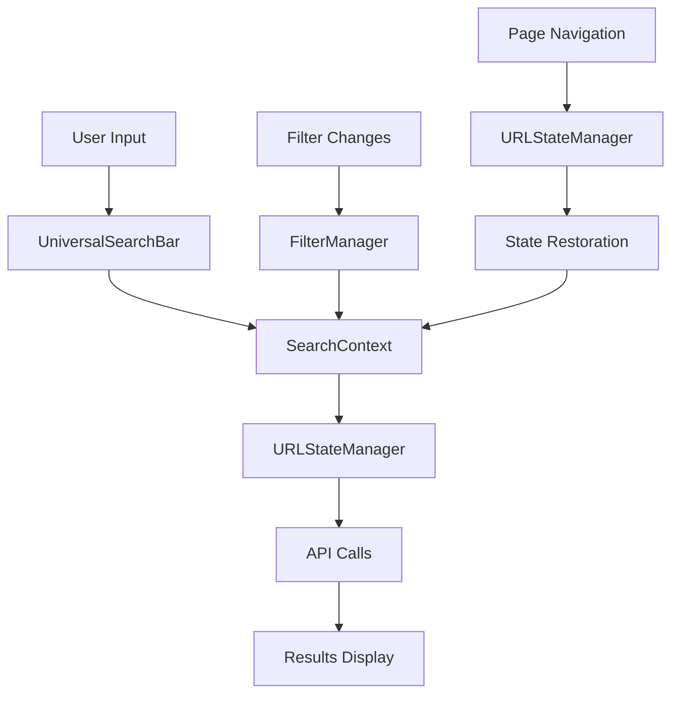

# Design Document

## Overview

This design outlines a unified search and filter system that consolidates all search functionality across the RentParLo platform. The system will provide consistent user experience, eliminate code duplication, ensure responsive design without horizontal scrollbars, and implement proper state management for filters and search queries.

## Architecture

### Component Hierarchy

```
UnifiedSearchSystem/
├── Core Components/
│   ├── UniversalSearchBar/
│   ├── UnifiedListingSearch/
│   ├── UnifiedBlogSearch/
│   └── FilterManager/
├── Page-Specific Wrappers/
│   ├── SearchPageWrapper/
│   ├── CategoryPageWrapper/
│   └── BlogPageWrapper/
├── Shared UI Components/
│   ├── FilterPanel/
│   ├── ActiveFilters/
│   ├── ClearFilters/
│   └── ResponsiveContainer/
└── State Management/
    ├── SearchContext/
    ├── FilterContext/
    └── URLStateManager/
```

### Data Flow Architecture



## Components and Interfaces

### 1. UniversalSearchBar Component

**Purpose**: Single search component used in header and hero sections

**Props Interface**:

```typescript
interface UniversalSearchBarProps {
  variant: "header" | "hero" | "inline";
  placeholder?: string;
  showLocationFilter?: boolean;
  showCategoryFilter?: boolean;
  onSearch: (query: string, filters: SearchFilters) => void;
  className?: string;
  size?: "sm" | "md" | "lg";
}
```

**Features**:

- Responsive design with breakpoint-specific layouts
- Auto-complete suggestions
- Recent searches
- Location and category quick filters
- Keyboard navigation support

### 2. UnifiedListingSearch Component

**Purpose**: Comprehensive search and filter system for listings

**Props Interface**:

```typescript
interface UnifiedListingSearchProps {
  initialFilters?: ListingFilters;
  categories: Category[];
  cities: City[];
  onFiltersChange: (filters: ListingFilters) => void;
  onSearch: (query: string) => void;
  showSidebar?: boolean;
  layout: "full" | "compact" | "minimal";
}

interface ListingFilters {
  query: string;
  category: string;
  city: string;
  area: string;
  condition: string;
  minPrice: number;
  maxPrice: number;
  availability: string;
  sortBy: string;
  priceType: string;
}
```

### 3. UnifiedBlogSearch Component

**Purpose**: Search and filter system specifically for blog content

**Props Interface**:

```typescript
interface UnifiedBlogSearchProps {
  initialFilters?: BlogFilters;
  categories: BlogCategory[];
  tags: string[];
  onFiltersChange: (filters: BlogFilters) => void;
  onSearch: (query: string) => void;
  layout: "sidebar" | "top" | "inline";
}

interface BlogFilters {
  query: string;
  category: string;
  tag: string;
  language: "en" | "ur";
  featured: boolean;
  dateRange: DateRange;
}
```

### 4. FilterManager Component

**Purpose**: Centralized filter management with clear/reset functionality

**Props Interface**:

```typescript
interface FilterManagerProps {
  filters: Record<string, any>;
  filterConfig: FilterConfig[];
  onFilterChange: (key: string, value: any) => void;
  onClearFilter: (key: string) => void;
  onClearAll: () => void;
  showActiveFilters?: boolean;
  layout: "horizontal" | "vertical" | "grid";
}

interface FilterConfig {
  key: string;
  type: "select" | "range" | "checkbox" | "search" | "date";
  label: string;
  options?: Option[];
  placeholder?: string;
  validation?: ValidationRule[];
}
```

## Data Models

### Search State Model

```typescript
interface SearchState {
  // Current search query
  query: string;

  // Active filters
  filters: Record<string, any>;

  // Search results
  results: SearchResult[];

  // Pagination
  pagination: {
    page: number;
    limit: number;
    total: number;
    hasMore: boolean;
  };

  // UI state
  isLoading: boolean;
  error: string | null;

  // View preferences
  viewMode: "grid" | "list" | "horizontal";
  sortBy: string;
}
```

### Filter Configuration Model

```typescript
interface FilterConfiguration {
  listings: {
    category: SelectFilter;
    location: LocationFilter;
    price: RangeFilter;
    condition: SelectFilter;
    availability: SelectFilter;
    priceType: SelectFilter;
  };

  blog: {
    category: SelectFilter;
    tags: MultiSelectFilter;
    language: SelectFilter;
    featured: BooleanFilter;
    dateRange: DateRangeFilter;
  };
}
```

## Error Handling

### Error Types and Recovery

1. **Network Errors**
   - Retry mechanism with exponential backoff
   - Offline state detection
   - Cached results fallback

2. **Validation Errors**
   - Real-time field validation
   - Clear error messaging
   - Auto-correction suggestions

3. **State Errors**
   - URL parameter validation
   - State restoration fallbacks
   - Default state recovery

### Error UI Components

```typescript
interface ErrorBoundaryProps {
  fallback: React.ComponentType<ErrorFallbackProps>;
  onError?: (error: Error, errorInfo: ErrorInfo) => void;
}

interface ErrorFallbackProps {
  error: Error;
  resetError: () => void;
  retry?: () => void;
}
```

## Testing Strategy

### Unit Testing

1. **Component Testing**
   - Search input validation
   - Filter state management
   - URL parameter handling
   - Responsive behavior

2. **Hook Testing**
   - Search debouncing
   - Filter state updates
   - URL synchronization
   - Error handling

### Integration Testing

1. **Search Flow Testing**
   - End-to-end search scenarios
   - Filter combinations
   - Page navigation with state
   - Cross-page consistency

2. **Responsive Testing**
   - Mobile layout validation
   - Tablet breakpoint behavior
   - Desktop functionality
   - No horizontal scroll verification

### Performance Testing

1. **Search Performance**
   - Query response times
   - Filter application speed
   - Large result set handling
   - Memory usage optimization

2. **Rendering Performance**
   - Component re-render optimization
   - Virtual scrolling for large lists
   - Image lazy loading
   - Bundle size analysis

## Responsive Design Strategy

### Breakpoint System

```scss
$breakpoints: (
  "mobile": 320px,
  "tablet": 768px,
  "desktop": 1024px,
  "wide": 1440px,
);
```

### Layout Adaptations

1. **Mobile (320px - 767px)**
   - Stacked filter layout
   - Collapsible filter panels
   - Full-width search bar
   - Touch-optimized controls

2. **Tablet (768px - 1023px)**
   - Side-by-side filter groups
   - Expandable filter sections
   - Hybrid navigation
   - Optimized touch targets

3. **Desktop (1024px+)**
   - Sidebar filter panels
   - Inline filter controls
   - Hover interactions
   - Keyboard shortcuts

### Horizontal Scroll Prevention

1. **Container Management**
   - Max-width constraints
   - Overflow handling
   - Flexible grid systems
   - Content wrapping

2. **Component Sizing**
   - Responsive image sizing
   - Flexible text containers
   - Adaptive button groups
   - Dynamic column counts

## State Management Architecture

### Context Providers

```typescript
// Search Context
interface SearchContextValue {
  searchState: SearchState;
  updateQuery: (query: string) => void;
  updateFilters: (filters: Partial<Record<string, any>>) => void;
  clearFilters: () => void;
  performSearch: () => Promise<void>;
}

// Filter Context
interface FilterContextValue {
  activeFilters: Record<string, any>;
  filterConfig: FilterConfiguration;
  setFilter: (key: string, value: any) => void;
  clearFilter: (key: string) => void;
  clearAllFilters: () => void;
  getActiveFilterCount: () => number;
}
```

### URL State Synchronization

```typescript
interface URLStateManager {
  // Sync state to URL
  syncToURL: (state: SearchState) => void;

  // Restore state from URL
  restoreFromURL: () => SearchState;

  // Handle browser navigation
  handlePopState: (event: PopStateEvent) => void;

  // Validate URL parameters
  validateURLParams: (params: URLSearchParams) => boolean;
}
```

## Performance Optimization

### Search Optimization

1. **Debouncing Strategy**
   - 300ms delay for search input
   - 100ms delay for filter changes
   - Immediate response for clear actions

2. **Caching Strategy**
   - Search result caching (5 minutes)
   - Filter option caching (30 minutes)
   - User preference caching (session)

3. **API Optimization**
   - Request deduplication
   - Batch filter updates
   - Pagination optimization
   - Prefetch next page

### Rendering Optimization

1. **Component Memoization**
   - React.memo for pure components
   - useMemo for expensive calculations
   - useCallback for event handlers

2. **Virtual Scrolling**
   - Large result set handling
   - Dynamic item height
   - Smooth scrolling experience

3. **Code Splitting**
   - Lazy load filter components
   - Dynamic import for heavy features
   - Route-based splitting

## Accessibility Implementation

### Keyboard Navigation

1. **Search Components**
   - Tab order management
   - Enter key submission
   - Escape key clearing
   - Arrow key navigation

2. **Filter Components**
   - Focus management
   - Keyboard shortcuts
   - Screen reader support
   - ARIA labels

### Screen Reader Support

1. **Announcements**
   - Search result counts
   - Filter state changes
   - Loading states
   - Error messages

2. **ARIA Implementation**
   - Proper role attributes
   - Live regions for updates
   - Descriptive labels
   - State indicators

## Migration Strategy

### Phase 1: Core Components (Week 1-2)

- Create UniversalSearchBar
- Implement FilterManager
- Set up SearchContext
- Basic responsive layout

### Phase 2: Listing Integration (Week 3-4)

- Migrate search page
- Update category pages
- Implement UnifiedListingSearch
- URL state management

### Phase 3: Blog Integration (Week 5-6)

- Create UnifiedBlogSearch
- Migrate blog pages
- Implement blog filters
- Cross-page consistency

### Phase 4: Optimization (Week 7-8)

- Performance optimization
- Accessibility improvements
- Testing and bug fixes
- Documentation updates

## Security Considerations

### Input Validation

1. **Search Query Sanitization**
   - XSS prevention
   - SQL injection protection
   - Input length limits
   - Special character handling

2. **Filter Validation**
   - Type checking
   - Range validation
   - Enum value verification
   - Malicious input detection

### API Security

1. **Request Validation**
   - Parameter sanitization
   - Rate limiting
   - Authentication checks
   - CORS configuration

2. **Data Protection**
   - Sensitive data filtering
   - PII protection
   - Audit logging
   - Error message sanitization
