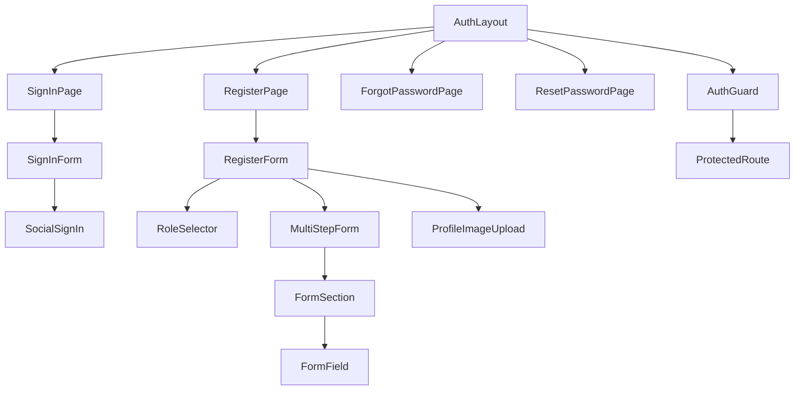
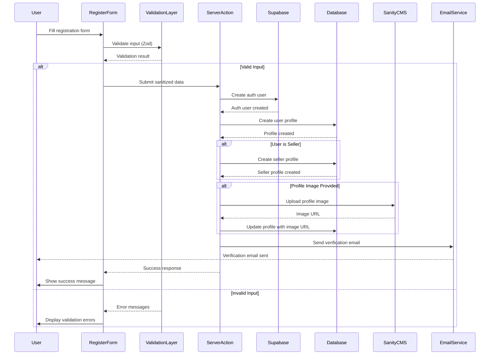
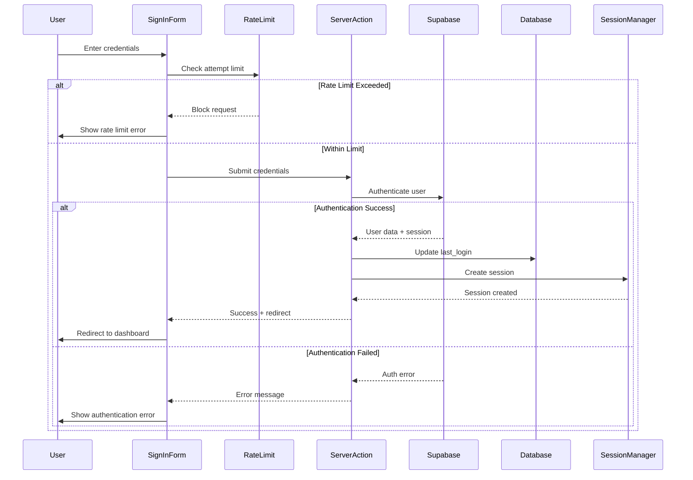

# Complete Authentication System with Supabase Integration

## Overview

This design outlines the implementation of a complete, production-ready authentication system for RentParLo.pk, integrating Supabase for user authentication and data management, with Sanity CMS for profile image storage. The system will feature responsive design, smooth animations, reusable components, and comprehensive functionality including user registration, seller onboarding, email verification, password reset, and session management.

## Technology Stack & Dependencies

### Core Authentication
- **Supabase**: Authentication service, user data, and database management
- **Next.js Server Actions**: Server-side form handling and API routes
- **Middleware**: Route protection and session management

### Frontend & UI
- **React Hook Form**: Form state management and validation
- **Zod**: Schema validation and type safety
- **Tailwind CSS**: Responsive styling and animations
- **Radix UI**: Accessible component primitives
- **Framer Motion**: Advanced animations and transitions

### Media Management
- **Sanity CMS**: Profile image storage and optimization
- **@sanity/image-url**: Image transformation and delivery

## Component Architecture

### Authentication Component Hierarchy



### Component Specifications

#### 1. Enhanced FormField Component
Reusable form field component with validation, animations, and accessibility features.

**Props Interface:**
```typescript
interface FormFieldProps {
  id: string;
  name: string;
  label: string;
  type: 'text' | 'email' | 'password' | 'tel' | 'checkbox' | 'select' | 'textarea';
  placeholder?: string;
  value: any;
  error?: string;
  required?: boolean;
  disabled?: boolean;
  options?: Array<{ value: string; label: string }>;
  icon?: React.ComponentType;
  onChange: (value: any) => void;
  onBlur?: () => void;
  className?: string;
  animation?: 'slide' | 'fade' | 'scale';
}
```

**Animation States:**
- Error state: Shake animation + red border
- Focus state: Smooth border color transition
- Loading state: Skeleton animation
- Success state: Green checkmark with scale animation

#### 2. MultiStepForm Component
Progressive form component with step navigation and validation.

**Features:**
- Progress indicator with completion percentage
- Step validation before navigation
- Smooth transitions between steps
- Mobile-responsive step indicator
- Save progress functionality

**Step Configuration:**
```typescript
interface Step {
  id: string;
  title: string;
  description: string;
  fields: string[];
  component: React.ComponentType;
  validation?: ZodSchema;
}
```

#### 3. ProfileImageUpload Component
Sanity-integrated image upload component for user avatars.

**Features:**
- Drag-and-drop interface
- Image preview and cropping
- Sanity CDN optimization
- Loading states and error handling
- Image format validation

## Authentication Flow & Business Logic

### User Registration Flow



### Sign-In Flow with Enhanced Security



## Responsive Design & Animations

### Responsive Breakpoints
- **Mobile**: 320px - 767px (Single column, stacked forms)
- **Tablet**: 768px - 1023px (Centered forms with sidebars)
- **Desktop**: 1024px+ (Split layout with hero sections)

### Animation Specifications

#### Form Transitions
```typescript
const formAnimations = {
  step: {
    initial: { opacity: 0, x: 50 },
    animate: { opacity: 1, x: 0 },
    exit: { opacity: 0, x: -50 },
    transition: { duration: 0.3, ease: "easeInOut" }
  },
  
  field: {
    focus: { scale: 1.02, borderColor: "rgb(59 130 246)" },
    error: { 
      x: [-5, 5, -5, 5, 0],
      borderColor: "rgb(239 68 68)",
      transition: { duration: 0.4 }
    },
    success: {
      borderColor: "rgb(34 197 94)",
      transition: { duration: 0.2 }
    }
  }
};
```

#### Loading States
- **Button Loading**: Spinner with text transition
- **Form Loading**: Skeleton placeholders
- **Page Loading**: Progress bar with percentage

#### Success Animations
- **Registration Success**: Confetti animation + slide-up modal
- **Sign-In Success**: Smooth redirect with fade transition
- **Verification Success**: Checkmark animation + celebration

## State Management

### Form State Architecture
```typescript
interface AuthFormState {
  // Current form data
  formData: RegistrationFormData | SignInFormData;
  
  // Validation state
  errors: Record<string, string>;
  touchedFields: Set<string>;
  isValid: boolean;
  
  // UI state
  currentStep: number;
  isLoading: boolean;
  isSubmitting: boolean;
  
  // Progress tracking
  completedSteps: Set<number>;
  savedProgress: Partial<RegistrationFormData>;
  
  // Animation state
  animationState: 'idle' | 'loading' | 'success' | 'error';
}
```

### Session Management
```typescript
interface SessionState {
  user: User | null;
  session: Session | null;
  isLoading: boolean;
  isAuthenticated: boolean;
  userRole: 'user' | 'seller' | 'admin';
  permissions: string[];
}
```

## API Endpoints & Server Actions

### Enhanced Server Actions

#### 1. Registration Action
```typescript
async function registerUser(formData: FormData): Promise<ActionResult> {
  // Rate limiting (3 attempts per 15 minutes)
  // Input sanitization and validation
  // Supabase user creation
  // Profile creation (user/seller)
  // Sanity image upload (if provided)
  // Email verification trigger
  // Success/error response
}
```

#### 2. Enhanced Sign-In Action
```typescript
async function signIn(formData: FormData): Promise<ActionResult> {
  // Rate limiting (5 attempts per 15 minutes)
  // Input sanitization
  // Supabase authentication
  // Session creation
  // Last login update
  // Redirect handling
}
```

#### 3. Profile Image Upload Action
```typescript
async function uploadProfileImage(
  imageFile: File,
  userId: string
): Promise<{ url: string; error?: string }> {
  // File validation (type, size)
  // Sanity upload
  // Image optimization
  // Database update
  // CDN URL return
}
```

### API Routes

#### Email Verification
```typescript
// app/auth/confirm/route.ts
export async function GET(request: Request) {
  // Extract token from URL
  // Verify with Supabase
  // Update user verification status
  // Redirect to success/error page
}
```

#### Password Reset
```typescript
// app/auth/reset-password/route.ts
export async function POST(request: Request) {
  // Validate email
  // Generate reset token
  // Send reset email
  // Return success response
}
```

## Data Models & ORM Mapping

### Enhanced User Profile Schema
```sql
-- Extended users table
ALTER TABLE public.users ADD COLUMN IF NOT EXISTS profile_image_url TEXT;
ALTER TABLE public.users ADD COLUMN IF NOT EXISTS onboarding_completed BOOLEAN DEFAULT false;
ALTER TABLE public.users ADD COLUMN IF NOT EXISTS email_notifications BOOLEAN DEFAULT true;
ALTER TABLE public.users ADD COLUMN IF NOT EXISTS sms_notifications BOOLEAN DEFAULT true;
ALTER TABLE public.users ADD COLUMN IF NOT EXISTS marketing_emails BOOLEAN DEFAULT false;
ALTER TABLE public.users ADD COLUMN IF NOT EXISTS two_factor_enabled BOOLEAN DEFAULT false;
ALTER TABLE public.users ADD COLUMN IF NOT EXISTS last_password_change TIMESTAMPTZ DEFAULT NOW();
```

### Seller Profile Extensions
```sql
-- Additional seller fields
ALTER TABLE public.seller_profiles ADD COLUMN IF NOT EXISTS social_media_links JSONB DEFAULT '{}';
ALTER TABLE public.seller_profiles ADD COLUMN IF NOT EXISTS business_hours JSONB DEFAULT '{}';
ALTER TABLE public.seller_profiles ADD COLUMN IF NOT EXISTS response_time_avg INTEGER DEFAULT 0;
ALTER TABLE public.seller_profiles ADD COLUMN IF NOT EXISTS customer_rating DECIMAL(3,2) DEFAULT 0.0;
```

### Authentication Logs
```sql
CREATE TABLE IF NOT EXISTS public.auth_logs (
  id UUID PRIMARY KEY DEFAULT gen_random_uuid(),
  user_id UUID REFERENCES public.users(id),
  action TEXT NOT NULL, -- 'login', 'logout', 'register', 'password_reset'
  ip_address INET,
  user_agent TEXT,
  success BOOLEAN NOT NULL,
  error_message TEXT,
  created_at TIMESTAMPTZ DEFAULT NOW()
);
```

## Middleware & Route Protection

### Enhanced Authentication Middleware
```typescript
export async function middleware(request: NextRequest) {
  const { pathname } = request.nextUrl;
  
  // Public routes (no authentication required)
  const publicRoutes = [
    '/', '/about', '/contact', '/blog',
    '/auth/login', '/auth/register', '/auth/forgot-password'
  ];
  
  // Protected routes (authentication required)
  const protectedRoutes = [
    '/dashboard', '/profile', '/listings/create', '/messages'
  ];
  
  // Admin-only routes
  const adminRoutes = [
    '/admin', '/studio'
  ];
  
  // Seller-only routes
  const sellerRoutes = [
    '/seller/dashboard', '/seller/listings', '/seller/analytics'
  ];
  
  // Authentication logic
  const supabase = createMiddlewareClient(request);
  const { data: { user } } = await supabase.auth.getUser();
  
  // Route protection logic
  if (protectedRoutes.some(route => pathname.startsWith(route))) {
    if (!user) {
      return NextResponse.redirect(new URL('/auth/login', request.url));
    }
  }
  
  // Role-based protection
  if (adminRoutes.some(route => pathname.startsWith(route))) {
    const { data: userProfile } = await supabase
      .from('users')
      .select('role')
      .eq('id', user?.id)
      .single();
      
    if (userProfile?.role !== 'admin') {
      return NextResponse.redirect(new URL('/unauthorized', request.url));
    }
  }
  
  return NextResponse.next();
}
```

## Testing Strategy

### Unit Testing
- **Form Components**: Input validation, state management, error handling
- **Server Actions**: Authentication logic, data sanitization, error scenarios
- **Validation Schemas**: Zod schema validation for all input types
- **Utility Functions**: Sanitization, rate limiting, image processing

### Integration Testing
- **Authentication Flow**: Complete user registration and sign-in process
- **Supabase Integration**: Database operations, user creation, session management
- **Sanity Integration**: Image upload, optimization, URL generation
- **Email Service**: Verification emails, password reset emails

### End-to-End Testing
- **User Registration Journey**: From form submission to email verification
- **Sign-In Flow**: Complete authentication with different user roles
- **Password Reset**: Full password reset workflow
- **Profile Management**: Image upload, profile updates, settings changes

## Security Implementation

### Input Sanitization
```typescript
const sanitizationRules = {
  email: (value: string) => value.toLowerCase().trim(),
  phone: (value: string) => value.replace(/\D/g, ''),
  name: (value: string) => value.trim().replace(/[<>]/g, ''),
  password: (value: string) => value, // No transformation, just validation
  cnic: (value: string) => value.replace(/\D/g, '').replace(/(\d{5})(\d{7})(\d{1})/, '$1-$2-$3')
};
```

### Rate Limiting
- **Login Attempts**: 5 per 15 minutes per IP
- **Registration**: 3 per 15 minutes per IP
- **Password Reset**: 2 per hour per email
- **Email Verification**: 3 per hour per user

### CSRF Protection
- Server Actions automatically include CSRF protection
- Form tokens for additional security
- SameSite cookie configuration

### Data Validation
- Client-side: Zod schemas with immediate feedback
- Server-side: Double validation before database operations
- Database: Constraints and triggers for data integrity

## Performance Optimization

### Image Optimization
- **Sanity CDN**: Automatic format selection (WebP, AVIF)
- **Responsive Images**: Multiple sizes for different viewports
- **Lazy Loading**: Profile images loaded on demand
- **Caching**: CDN caching with optimal cache headers

### Form Performance
- **Debounced Validation**: Reduce unnecessary validation calls
- **Memoized Components**: Prevent unnecessary re-renders
- **Progressive Enhancement**: Core functionality without JavaScript
- **Bundle Splitting**: Separate chunks for auth components

## Deployment Considerations

### Environment Variables
```env
# Supabase Configuration
NEXT_PUBLIC_SUPABASE_URL=https://your-project.supabase.co
NEXT_PUBLIC_SUPABASE_ANON_KEY=your-anon-key
SUPABASE_SERVICE_ROLE_KEY=your-service-role-key

# Sanity Configuration
NEXT_PUBLIC_SANITY_PROJECT_ID=your-project-id
NEXT_PUBLIC_SANITY_DATASET=production
SANITY_API_READ_TOKEN=your-read-token
SANITY_API_WRITE_TOKEN=your-write-token

# Email Configuration
RESEND_API_KEY=your-resend-key
SMTP_FROM_EMAIL=noreply@rentparlo.pk

# Security
NEXTAUTH_SECRET=your-secret-key
ENCRYPTION_KEY=your-encryption-key
```

### Database Migrations
- User table extensions for new fields
- Authentication logs table creation
- Indexes for performance optimization
- RLS policies for data security

### Monitoring & Analytics
- **Authentication Metrics**: Success/failure rates, popular registration times
- **Performance Monitoring**: Form completion times, error rates
- **Security Monitoring**: Failed login attempts, suspicious activities
- **User Analytics**: Registration conversion rates, user engagement