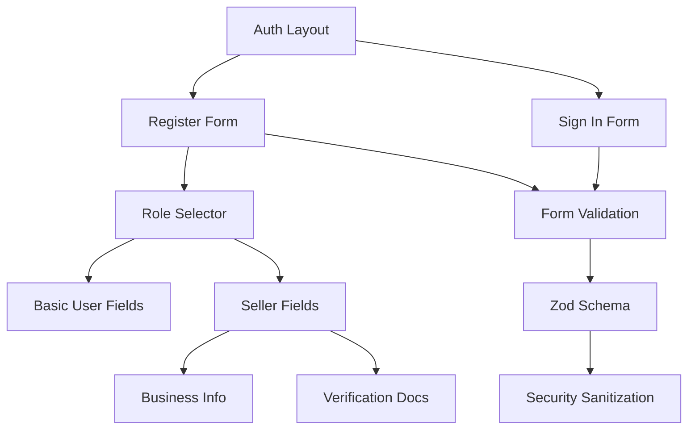
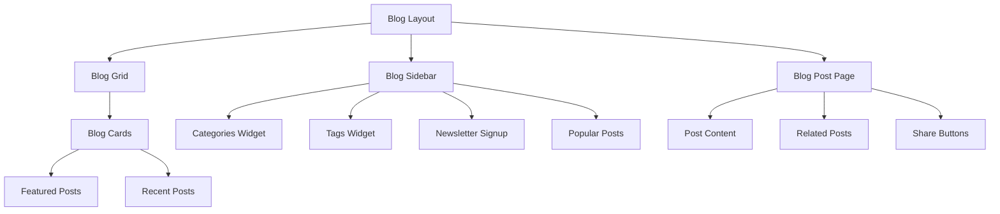

# Multi-Page Forms & Blog System Design

## Overview

This design document outlines the implementation of enhanced authentication forms (sign-in/register for both users and sellers) and a comprehensive blog system. The design builds upon existing reusable components in the RentParlo.pk platform while maintaining architectural integrity and security best practices.

## Architecture

The implementation follows the established component-driven architecture with clear separation of concerns:

### Component Hierarchy
```
Pages Layer
├── Authentication Pages (app/auth/)
│   ├── sign-in/page.tsx
│   ├── register/page.tsx
│   └── layout.tsx
├── Blog Pages (app/blog/)
│   ├── page.tsx
│   ├── [slug]/page.tsx
│   └── category/[category]/page.tsx
└── Static Pages (app/)
    ├── about/page.tsx
    └── contact/page.tsx

Components Layer
├── Auth Components (components/auth/)
│   ├── auth-layout.tsx
│   ├── sign-in-form.tsx
│   ├── register-form.tsx
│   └── role-selector.tsx
├── Blog Components (components/blog/)
│   ├── blog-grid.tsx
│   ├── blog-card.tsx
│   ├── blog-sidebar.tsx
│   ├── blog-hero.tsx
│   └── blog-post-content.tsx
└── Form Components (components/forms/)
    ├── form-field.tsx
    ├── form-section.tsx
    └── multi-step-form.tsx
```

## Authentication System Design

### Form Architecture Pattern

The authentication system uses a progressive enhancement approach with unified form handling while adapting to different user roles.



### Component Specifications

#### AuthLayout Component
```typescript
interface AuthLayoutProps {
  children: React.ReactNode;
  title: string;
  subtitle?: string;
  showBackButton?: boolean;
  backgroundImage?: string;
}
```

**Features:**
- Responsive centered container
- RentParlo branding integration
- Mobile-optimized layout
- Background image support
- Navigation breadcrumbs

#### SignInForm Component
```typescript
interface SignInFormData {
  email: string;
  password: string;
  rememberMe?: boolean;
}
```

**Form Structure:**
- Email/Password fields with validation
- Remember me checkbox
- Forgot password link
- Social login options (Google OAuth)
- Role-based redirect logic

#### RegisterForm Component
```typescript
interface RegisterFormData {
  role: 'user' | 'seller';
  // Basic Information
  name: string;
  email: string;
  phone: string;
  password: string;
  confirmPassword: string;
  city: string;
  terms: boolean;
  // Seller-specific fields
  businessName?: string;
  cnic?: string;
  address?: string;
  verificationDocs?: FileList;
}
```

**Multi-Step Flow:**
1. **Step 1: Role Selection**
   - User vs Seller toggle
   - Role description cards
   
2. **Step 2: Basic Information**
   - Common fields for both roles
   - Real-time validation
   
3. **Step 3: Role-Specific Information** (Conditional)
   - Seller verification requirements
   - Document upload interface
   
4. **Step 4: Review & Submit**
   - Form summary
   - Terms acceptance
   - Final validation

### Security Implementation

#### Zod Validation Schemas

```typescript
// Base schema for common fields
const baseUserSchema = z.object({
  name: z.string()
    .min(2, 'Name must be at least 2 characters')
    .max(50, 'Name must be less than 50 characters')
    .regex(/^[a-zA-Z\s]+$/, 'Name can only contain letters and spaces'),
  
  email: z.string()
    .email('Invalid email address')
    .toLowerCase()
    .refine(email => !email.includes('+'), 'Email aliases not allowed'),
  
  phone: z.string()
    .regex(/^(\+92|0)?3[0-9]{9}$/, 'Invalid Pakistani phone number'),
  
  password: z.string()
    .min(8, 'Password must be at least 8 characters')
    .regex(/^(?=.*[a-z])(?=.*[A-Z])(?=.*\d)/, 'Password must contain uppercase, lowercase, and number'),
  
  city: z.enum(['Karachi', 'Lahore', 'Islamabad', 'Rawalpindi', 'Faisalabad', 'Multan', 'Peshawar', 'Quetta'])
});

// Seller-specific extension
const sellerSchema = baseUserSchema.extend({
  role: z.literal('seller'),
  businessName: z.string().min(2).max(100).optional(),
  cnic: z.string()
    .regex(/^\d{5}-\d{7}-\d{1}$/, 'CNIC must be in format XXXXX-XXXXXXX-X')
    .optional(),
  address: z.string().min(10).max(200).optional()
});
```

#### Input Sanitization

```typescript
import DOMPurify from 'isomorphic-dompurify';
import validator from 'validator';

const sanitizeInput = (input: string): string => {
  // Remove HTML tags and scripts
  const cleaned = DOMPurify.sanitize(input, { ALLOWED_TAGS: [] });
  
  // Escape SQL injection patterns
  return validator.escape(cleaned.trim());
};

const sanitizeFormData = <T extends Record<string, any>>(data: T): T => {
  const sanitized = {} as T;
  
  for (const [key, value] of Object.entries(data)) {
    if (typeof value === 'string') {
      sanitized[key as keyof T] = sanitizeInput(value) as T[keyof T];
    } else {
      sanitized[key as keyof T] = value;
    }
  }
  
  return sanitized;
};
```

## Blog System Design

### Blog Architecture Pattern

The blog system provides a content-rich experience with SEO optimization and performance considerations.



### Component Specifications

#### BlogGrid Component
```typescript
interface BlogGridProps {
  posts: BlogPost[];
  category?: string;
  featured?: boolean;
  pagination?: PaginationProps;
  loading?: boolean;
}
```

**Layout Patterns:**
- Masonry grid for varied content heights
- Featured post hero section
- Infinite scroll or pagination
- Category filtering
- Search functionality

#### BlogCard Component
```typescript
interface BlogCardProps {
  post: BlogPost;
  variant?: 'default' | 'featured' | 'compact';
  showExcerpt?: boolean;
  showAuthor?: boolean;
  showDate?: boolean;
  showCategory?: boolean;
}
```

**Design Variants:**
- **Featured**: Large image, full excerpt, prominent placement
- **Default**: Medium image, short excerpt, standard grid item
- **Compact**: Small image, title only, sidebar usage

#### BlogSidebar Component
```typescript
interface BlogSidebarProps {
  categories: Category[];
  popularPosts: BlogPost[];
  tags: string[];
  showNewsletter?: boolean;
  showAds?: boolean;
}
```

**Sidebar Widgets:**
- Categories list with post counts
- Popular/recent posts
- Tag cloud
- Newsletter signup
- Advertisement banners
- Search widget

### Content Management Integration

#### Sanity Schema Enhancement

The existing blog schema in `sanity/SchemaTypes/blog.ts` provides a solid foundation. Additional fields for enhanced functionality:

```typescript
// Enhanced blog schema fields
const enhancedBlogFields = [
  // SEO and Social
  defineField({
    name: 'seo',
    title: 'SEO Settings',
    type: 'object',
    fields: [
      { name: 'metaTitle', type: 'string', title: 'Meta Title' },
      { name: 'metaDescription', type: 'text', title: 'Meta Description' },
      { name: 'focusKeyword', type: 'string', title: 'Focus Keyword' },
      { name: 'socialImage', type: 'image', title: 'Social Share Image' }
    ]
  }),
  
  // Reading time and engagement
  defineField({
    name: 'readingTime',
    title: 'Reading Time (minutes)',
    type: 'number',
    readOnly: true
  }),
  
  // Related posts
  defineField({
    name: 'relatedPosts',
    title: 'Related Posts',
    type: 'array',
    of: [{ type: 'reference', to: { type: 'blog' } }],
    validation: Rule => Rule.max(3)
  })
];
```

## Static Pages Design

### About Us Page
**Content Structure:**
- Hero section with company mission
- Team member cards
- Company timeline
- Values and principles
- Contact call-to-action

### Contact Us Page
**Form Components:**
- Contact form with validation
- Multiple contact methods
- Office location map
- Support hours
- FAQ section

**Contact Form Schema:**
```typescript
const contactFormSchema = z.object({
  name: z.string().min(2).max(50),
  email: z.string().email(),
  subject: z.enum(['General', 'Support', 'Business', 'Press']),
  message: z.string().min(10).max(1000),
  urgency: z.enum(['Low', 'Medium', 'High']).default('Medium')
});
```

## Performance Optimization

### Loading States and Skeleton UI

#### Authentication Forms
- Progressive form field loading
- Step indicator with loading states
- Document upload progress bars
- Real-time validation feedback

#### Blog System
- Blog card skeletons during loading
- Sidebar widget placeholders
- Progressive image loading
- Infinite scroll loading indicators

### SEO Implementation

#### Meta Tag Management
```typescript
// Dynamic meta tags for blog posts
export async function generateMetadata(
  { params }: { params: { slug: string } }
): Promise<Metadata> {
  const post = await getBlogPost(params.slug);
  
  return {
    title: post.seo?.metaTitle || post.title,
    description: post.seo?.metaDescription || post.excerpt,
    keywords: [post.seo?.focusKeyword, ...post.categories.map(c => c.title)],
    openGraph: {
      title: post.title,
      description: post.excerpt,
      images: [post.seo?.socialImage?.url || post.mainImage?.url],
      type: 'article',
      publishedTime: post.publishedAt,
      authors: [post.author]
    },
    twitter: {
      card: 'summary_large_image',
      title: post.title,
      description: post.excerpt,
      images: [post.seo?.socialImage?.url || post.mainImage?.url]
    }
  };
}
```

#### Structured Data
```typescript
// JSON-LD structured data for blog posts
const generateBlogPostStructuredData = (post: BlogPost) => ({
  '@context': 'https://schema.org',
  '@type': 'BlogPosting',
  headline: post.title,
  description: post.excerpt,
  image: post.mainImage?.url,
  author: {
    '@type': 'Person',
    name: post.author
  },
  publisher: {
    '@type': 'Organization',
    name: 'RentParlo.pk',
    logo: '/logo.png'
  },
  datePublished: post.publishedAt,
  dateModified: post.updatedAt
});
```

## Mobile Responsiveness

### Authentication Forms
- **Mobile-First Design**: Optimized for touch interactions
- **Step Navigation**: Clear progress indicators
- **Field Grouping**: Logical sections with collapsible areas
- **Touch Targets**: Minimum 44px touch targets
- **Keyboard Support**: Proper tab order and input types

### Blog System
- **Responsive Grid**: CSS Grid with auto-fit columns
- **Image Optimization**: WebP format with fallbacks
- **Touch Gestures**: Swipe navigation for related posts
- **Sticky Navigation**: Persistent category filters
- **Bottom Sheet**: Mobile-optimized sidebar as bottom sheet

## Accessibility Features

### Form Accessibility
- **ARIA Labels**: Comprehensive labeling for screen readers
- **Error Handling**: Clear error messages with ARIA live regions
- **Keyboard Navigation**: Full keyboard accessibility
- **Focus Management**: Logical focus flow through form steps
- **Color Contrast**: WCAG AA compliant color combinations

### Blog Accessibility
- **Semantic HTML**: Proper heading hierarchy
- **Alt Text**: Descriptive image alternative text
- **Skip Links**: Navigation shortcuts
- **Reading Mode**: High contrast and large text options
- **Screen Reader**: Optimized content structure

## Testing Strategy

### Form Validation Testing
```typescript
// Example test for registration form
describe('RegisterForm', () => {
  test('validates CNIC format for sellers', async () => {
    const validCnic = '12345-1234567-1';
    const invalidCnic = '12345-123456-1';
    
    expect(sellerSchema.parse({ cnic: validCnic })).toBeTruthy();
    expect(() => sellerSchema.parse({ cnic: invalidCnic })).toThrow();
  });
  
  test('sanitizes input data', () => {
    const maliciousInput = '<script>alert("xss")</script>Valid Name';
    const sanitized = sanitizeInput(maliciousInput);
    
    expect(sanitized).toBe('Valid Name');
    expect(sanitized).not.toContain('<script>');
  });
});
```

### Component Integration Tests
- Form submission workflows
- Multi-step navigation
- Role-based field visibility
- Error state handling
- Loading state management

## Implementation Priority

### Phase 1: Authentication Enhancement
1. Enhanced sign-in form with improved UX
2. Multi-step registration with role selection
3. Seller verification workflow
4. Security hardening and input sanitization

### Phase 2: Blog System
1. Blog grid and card components
2. Blog post detail pages
3. Category and tag filtering
4. SEO optimization

### Phase 3: Static Pages
1. About us page with team section
2. Contact us page with form
3. Additional informational pages

### Phase 4: Advanced Features
1. Social authentication integration
2. Advanced blog features (comments, sharing)
3. Newsletter integration
4. Analytics implementation

This design maintains compatibility with existing components while providing comprehensive functionality for authentication and blog systems. The implementation follows established patterns and security best practices suitable for the Pakistani market context.