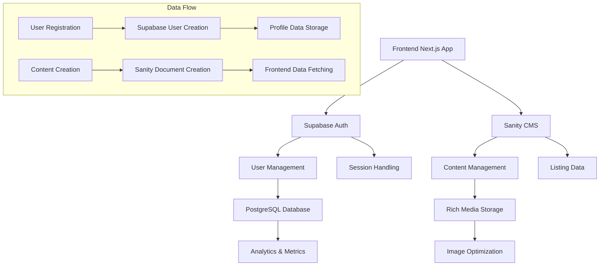
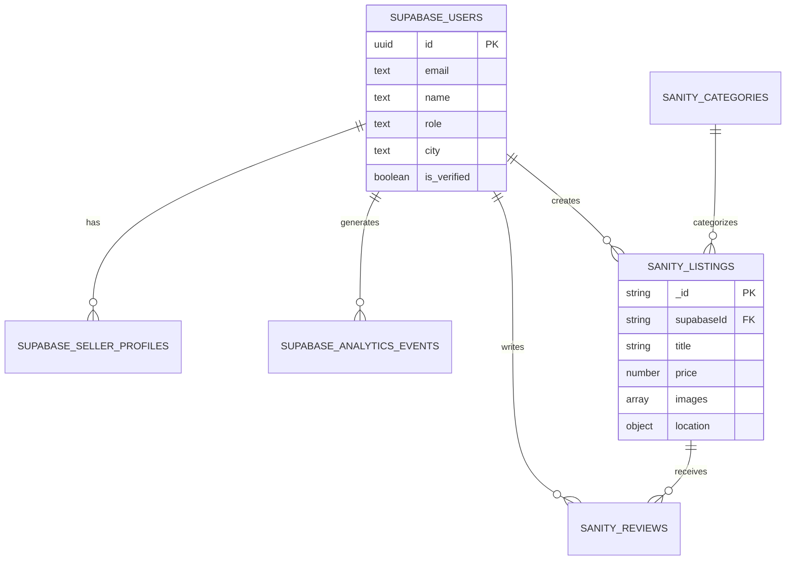
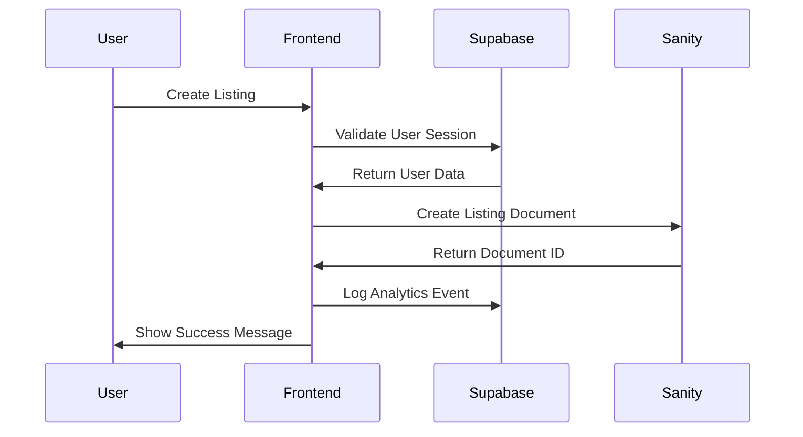

# Sanity-Supabase Integration Design for RentParlo.pk

## Overview

This design document outlines the complete integration strategy for connecting RentParlo.pk with Sanity CMS and Supabase database. The integration encompasses user authentication, content management, data synchronization, and frontend implementation to create a seamless rental marketplace experience.

## Architecture Overview



## Database Schema Analysis

### Supabase Schema Structure
Based on the provided `schema.sql`, the database includes:

1. **Users Table**: Core user management with authentication
2. **Seller Profiles**: Extended seller information with verification
3. **Subscription Packages**: Seller tier management
4. **Analytics Events**: User interaction tracking
5. **Support System**: Ticket management
6. **Affiliate Program**: Marketing and referral system

### Sanity Schema Structure
Based on the provided schemas:

1. **Listing**: Product/item listings with rich content
2. **Category**: Hierarchical category management
3. **Blog**: Content marketing system
4. **Banner**: Homepage promotional content
5. **Review**: User feedback system
6. **Ad Banner**: Advertisement management

## Integration Strategy

### 1. Data Relationship Model



### 2. Authentication Flow

#### User Registration Process
1. **Frontend Form Submission**
   - Collect user data (name, email, password, role)
   - Validate using Zod schemas
   - Handle seller-specific fields (CNIC, business info)

2. **Supabase User Creation**
   - Create auth user with email/password
   - Insert user data into `users` table
   - Create seller profile if role is 'seller'
   - Send email verification

3. **Profile Completion**
   - Redirect to profile completion page
   - Upload profile images to Sanity
   - Complete business verification for sellers

#### Authentication Implementation

```typescript
// Authentication service structure
interface AuthService {
  signUp(userData: UserRegistrationData): Promise<AuthResult>
  signIn(credentials: LoginCredentials): Promise<AuthResult>
  signOut(): Promise<void>
  getUser(): Promise<User | null>
  updateProfile(profileData: ProfileData): Promise<UpdateResult>
}

// User data types
interface UserRegistrationData {
  email: string
  password: string
  name: string
  phone: string
  city: string
  role: 'user' | 'seller'
  sellerData?: SellerRegistrationData
}

interface SellerRegistrationData {
  businessName?: string
  cnic: string
  address: AddressData
  documents: DocumentUpload[]
}
```

### 3. Content Management Strategy

#### Sanity-Supabase Data Synchronization



#### Data Flow Patterns

1. **User-Generated Content (Listings)**
   - Created in Sanity with `supabaseId` reference
   - Analytics tracked in Supabase
   - Rich media stored in Sanity

2. **User Interactions (Reviews, Analytics)**
   - Reviews stored in Sanity with `supabaseUserId`
   - View/click events stored in Supabase
   - Aggregated metrics calculated server-side

3. **Content Management (Categories, Banners)**
   - Admin-managed content in Sanity
   - No direct Supabase relationship
   - Frontend fetches via GROQ queries

### 4. Data Seeding Strategy

#### Mock Data Requirements

1. **Supabase Seed Data**
   - Sample users (5 users)
   - Seller profiles with different tiers
   - Categories for filtering
   - Subscription packages
   - Analytics events for testing

2. **Sanity Seed Data**
   - Product categories with icons
   - Sample listings (20 items)
   - Blog posts for content marketing
   - Homepage banners
   - Sample reviews

#### Seeding Scripts

```sql
-- Supabase seeding script structure
INSERT INTO users (id, email, name, role, city, is_verified) VALUES
('uuid1', 'seller1@example.com', 'Ahmed Khan', 'seller', 'Karachi', true),
('uuid2', 'buyer1@example.com', 'Sara Ahmed', 'user', 'Lahore', true);

INSERT INTO seller_profiles (id, username, business_name, tier, is_verified) VALUES
('uuid1', 'ahmed_electronics', 'Ahmed Electronics', 'gold', true);

INSERT INTO categories (name, province) VALUES
('Karachi', 'Sindh'),
('Lahore', 'Punjab');

INSERT INTO subscription_packages (name, price, max_listings, features) VALUES
('Basic', 0, 5, '{"analytics_days": 30}'),
('Pro', 999, 20, '{"analytics_days": 90, "featured_listing": true}');
```

### 5. Frontend Implementation

#### Data Fetching Strategy

```typescript
// Server Components for initial data
export default async function ListingsPage() {
  const listings = await getListings()
  const categories = await getCategories()
  
  return (
    <ListingsGrid 
      initialListings={listings}
      categories={categories}
    />
  )
}

// Client Components for interactions
'use client'
export function ListingCard({ listing }: { listing: Listing }) {
  const { user } = useAuth()
  
  const handleContact = async () => {
    if (!user) {
      router.push('/auth/login')
      return
    }
    
    // Track analytics event
    await trackEvent('contact_click', {
      listingId: listing._id,
      userId: user.id
    })
    
    // Open WhatsApp or phone
    window.open(`https://wa.me/${listing.seller.phone}`)
  }
  
  return (
    <Card>
      {/* Listing content */}
      <Button onClick={handleContact}>Contact Seller</Button>
    </Card>
  )
}
```

#### State Management

```typescript
// Zustand store for global state
interface AppState {
  user: User | null
  listings: Listing[]
  categories: Category[]
  filters: FilterState
  
  // Actions
  setUser: (user: User | null) => void
  updateListings: (listings: Listing[]) => void
  setFilters: (filters: FilterState) => void
}

// React Query for server state
export function useListings(filters: FilterState) {
  return useQuery({
    queryKey: ['listings', filters],
    queryFn: () => fetchListings(filters),
    staleTime: 5 * 60 * 1000, // 5 minutes
  })
}
```

### 6. API Integration Patterns

#### Supabase Integration

```typescript
// User management
export class UserService {
  private supabase = createClient()
  
  async getCurrentUser(): Promise<User | null> {
    const { data: { user } } = await this.supabase.auth.getUser()
    if (!user) return null
    
    const { data: profile } = await this.supabase
      .from('users')
      .select('*, seller_profiles(*)')
      .eq('id', user.id)
      .single()
    
    return profile
  }
  
  async updateProfile(userId: string, updates: ProfileUpdate) {
    return this.supabase
      .from('users')
      .update(updates)
      .eq('id', userId)
  }
}

// Analytics tracking
export class AnalyticsService {
  private supabase = createClient()
  
  async trackEvent(eventType: string, data: EventData) {
    return this.supabase
      .from('analytics_events')
      .insert({
        event_type: eventType,
        listing_id: data.listingId,
        user_id: data.userId,
        created_at: new Date().toISOString()
      })
  }
}
```

#### Sanity Integration

```typescript
// Content fetching
export class ContentService {
  private client = sanityClient
  
  async getListings(filters: ListingFilters): Promise<Listing[]> {
    const query = `
      *[_type == "listing" && status == "active"] {
        _id,
        title,
        price,
        images,
        location,
        category->{name, slug},
        supabaseId
      }
    `
    
    return this.client.fetch(query)
  }
  
  async createListing(listingData: CreateListingData): Promise<string> {
    const doc = {
      _type: 'listing',
      ...listingData,
      status: 'pending',
      createdAt: new Date().toISOString()
    }
    
    const result = await this.client.create(doc)
    return result._id
  }
}
```

### 7. Security Implementation

#### Row Level Security (RLS)

```sql
-- Users can only view their own data
CREATE POLICY "Users can view own profile" ON users
  FOR SELECT TO authenticated
  USING (id = auth.uid());

-- Sellers can manage their own listings
CREATE POLICY "Sellers manage own listings" ON analytics_events
  FOR SELECT TO authenticated
  USING (user_id = auth.uid());

-- Admin access for management
CREATE POLICY "Admins can view all data" ON users
  FOR ALL TO authenticated
  USING (EXISTS (
    SELECT 1 FROM users 
    WHERE id = auth.uid() AND role = 'admin'
  ));
```

#### Input Validation

```typescript
// Zod schemas for validation
export const createListingSchema = z.object({
  title: z.string().min(10).max(100),
  description: z.string().min(50),
  price: z.number().positive(),
  category: z.string(),
  images: z.array(z.string()).min(1).max(10),
  location: z.object({
    city: z.string(),
    area: z.string()
  }),
  specifications: z.array(z.object({
    key: z.string(),
    value: z.string()
  }))
})

export const userRegistrationSchema = z.object({
  email: z.string().email(),
  password: z.string().min(8),
  name: z.string().min(2),
  phone: z.string().regex(/^(\+92|0)?[0-9]{10}$/),
  city: z.string(),
  role: z.enum(['user', 'seller'])
})
```

### 8. Performance Optimization

#### Caching Strategy

```typescript
// Server-side caching with Next.js
export async function getListings() {
  return cache(async () => {
    const listings = await sanityClient.fetch(`
      *[_type == "listing" && status == "active"] {
        _id, title, price, images[0], location
      }
    `)
    return listings
  }, ['listings'], {
    revalidate: 300 // 5 minutes
  })()
}

// Client-side caching with React Query
export function useListings() {
  return useQuery({
    queryKey: ['listings'],
    queryFn: getListings,
    staleTime: 5 * 60 * 1000,
    cacheTime: 30 * 60 * 1000
  })
}
```

#### Image Optimization

```typescript
// Sanity image optimization
export function getOptimizedImageUrl(image: SanityImageSource, options: ImageOptions) {
  return imageUrlBuilder(sanityClient)
    .image(image)
    .width(options.width)
    .height(options.height)
    .format('webp')
    .quality(80)
    .url()
}
```

### 9. Monitoring and Analytics

#### Event Tracking Implementation

```typescript
// Analytics wrapper
export class Analytics {
  static async track(event: string, properties: Record<string, any>) {
    // Track in Supabase for business analytics
    await supabase.from('analytics_events').insert({
      event_type: event,
      ...properties,
      created_at: new Date().toISOString()
    })
    
    // Track in Google Analytics for web analytics
    if (typeof gtag !== 'undefined') {
      gtag('event', event, properties)
    }
  }
}

// Usage in components
export function ListingCard({ listing }: { listing: Listing }) {
  const handleView = () => {
    Analytics.track('listing_view', {
      listing_id: listing._id,
      category: listing.category?.name,
      price: listing.price
    })
  }
  
  useEffect(() => {
    handleView()
  }, [])
}
```

### 10. Testing Strategy

#### Integration Testing

```typescript
// Test database operations
describe('User Registration', () => {
  it('should create user in Supabase and update profile', async () => {
    const userData = {
      email: 'test@example.com',
      password: 'password123',
      name: 'Test User',
      role: 'seller'
    }
    
    const result = await authService.signUp(userData)
    
    expect(result.user).toBeDefined()
    expect(result.user.role).toBe('seller')
  })
})

// Test Sanity operations
describe('Listing Management', () => {
  it('should create listing in Sanity with user reference', async () => {
    const listingData = {
      title: 'Test Camera',
      price: 1000,
      supabaseId: 'user-uuid'
    }
    
    const listingId = await contentService.createListing(listingData)
    const listing = await contentService.getListing(listingId)
    
    expect(listing.supabaseId).toBe('user-uuid')
  })
})
```

### 11. Deployment Configuration

#### Environment Variables

```env
# Supabase Configuration
NEXT_PUBLIC_SUPABASE_URL=your-supabase-url
NEXT_PUBLIC_SUPABASE_ANON_KEY=your-anon-key
SUPABASE_SERVICE_ROLE_KEY=your-service-role-key

# Sanity Configuration
NEXT_PUBLIC_SANITY_PROJECT_ID=your-project-id
NEXT_PUBLIC_SANITY_DATASET=production
SANITY_API_TOKEN=your-api-token

# Application Configuration
NEXT_PUBLIC_SITE_URL=https://rentparlo.pk
NEXTAUTH_SECRET=your-secret-key
```

#### Vercel Deployment

```json
{
  "version": 2,
  "env": {
    "NEXT_PUBLIC_SUPABASE_URL": "@supabase-url",
    "NEXT_PUBLIC_SUPABASE_ANON_KEY": "@supabase-anon-key",
    "NEXT_PUBLIC_SANITY_PROJECT_ID": "@sanity-project-id"
  },
  "build": {
    "env": {
      "SANITY_API_TOKEN": "@sanity-api-token"
    }
  }
}
```

## Implementation Roadmap

### Phase 1: Infrastructure Setup (Week 1)
1. Configure Supabase project and database
2. Set up Sanity project and schemas
3. Implement authentication system
4. Create seed data scripts

### Phase 2: Core Features (Week 2-3)
1. User registration and profile management
2. Listing creation and management
3. Search and filtering functionality
4. Basic seller dashboard

### Phase 3: Advanced Features (Week 4-5)
1. Analytics and tracking system
2. Review and rating system
3. Subscription management
4. Admin dashboard

### Phase 4: Optimization (Week 6)
1. Performance optimization
2. SEO implementation
3. Testing and bug fixes
4. Production deployment

## Risk Mitigation

### Data Consistency
- Implement transaction-like operations using Supabase RPC functions
- Regular data validation scripts
- Backup and recovery procedures

### Performance Issues
- Implement caching at multiple layers
- Use CDN for static assets
- Monitor database query performance

### Security Concerns
- Regular security audits
- Rate limiting implementation
- Input sanitization at all levels
- Regular dependency updates

This comprehensive integration design provides a robust foundation for connecting Sanity and Supabase with the RentParlo.pk application, ensuring scalability, security, and optimal user experience.