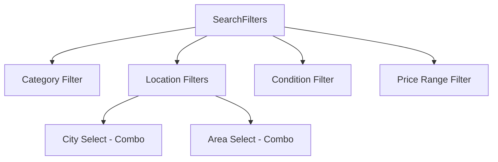
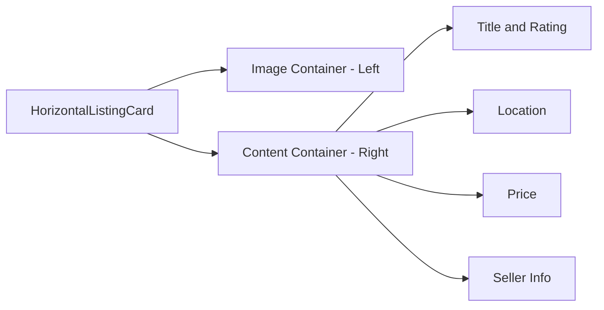

# Search Page Improvements Design Document

## 1. Overview

This document outlines the improvements to be made to the search functionality and search page of the RentParLo.pk platform. The improvements include:

1. Adding area selection to the search functionality
2. Implementing combo selection for city and area fields
3. Restructuring the location links section with categories and popular queries
4. Adding a horizontal listing card variant for the search results page
5. Ensuring all filters and search functionalities work across all pages, especially the search page

## 2. Architecture

### 2.1 Current Architecture

The current search functionality consists of:
- Search page (`/app/search/page.tsx`) that serves as the main entry point
- Search content component (`/components/search/search-content.tsx`) that handles UI and state
- Search filters component (`/components/search/search-filters.tsx`) that provides filter options
- Search results component (`/components/search/search-results.tsx`) that displays listings
- Listing card components (`/components/cards/listing-card.tsx` and `/components/listing/listing-card-compact.tsx`)
- API route (`/app/api/listings/route.ts`) that handles search queries
- Sanity queries (`/lib/sanity-queries.ts`) that fetch data from Sanity CMS
- Location links section (`/components/sections/location-links.tsx`) that provides quick search links

### 2.2 Proposed Architecture Changes

The improvements will involve:
- Modifying the search API to support area filtering
- Updating the Sanity search query to include area filtering
- Enhancing the search filters component to include area selection with combo box
- Creating a new horizontal listing card variant
- Restructuring the location links section to be category-based

## 3. Component Specifications

### 3.1 Search Filters Component Enhancements

#### Current Implementation
The current search filters component includes:
- Category filter (dropdown)
- Location filter (city dropdown only)
- Condition filter (dropdown)
- Price range filter (slider and presets)

#### Proposed Enhancements
1. Add area selection field below the city selection
2. Implement combo selection for both city and area fields using a searchable dropdown
3. Populate area options based on selected city
4. Update the filter change handler to include area parameter

#### Component Structure


### 3.2 Location Links Section Restructuring

#### Current Implementation
The current location links section displays a grid of generic location-based search links.

#### Proposed Structure
Restructure to show categories with popular queries and locations:
1. Group links by category (e.g., Camera, Automobiles, Medical Equipment)
2. For each category, show 5-6 popular search queries with different locations
3. Include at least 9 categories in total

#### Example Structure
```
Cameras
- Rent Camera in Karachi
- Rent Camera in Lahore
- Rent Camera in Islamabad
- Rent DSLR in Karachi
- Rent Camera Lens in Lahore
- Rent Professional Camera in Islamabad

Automobiles
- Rent Car in Karachi
- Rent Bike in Lahore
- Rent SUV in Islamabad
- Rent Luxury Car in Karachi
- Rent Economy Car in Lahore
- Rent 4x4 in Islamabad

Medical Equipment
- Rent Oxygen Concentrator in Karachi
- Rent BP Machine in Lahore
- Rent Nebulizer in Islamabad
- Rent Wheelchair in Karachi
- Rent Walker in Lahore
- Rent Hospital Bed in Islamabad
```

### 3.3 Horizontal Listing Card Variant

#### Current Implementation
The search results currently use either:
1. Grid view with standard listing cards (`ListingCard`)
2. List view with compact listing cards (`ListingCardCompact`)

#### Proposed Enhancement
Enhance the `ListingCard` component to support a horizontal variant that:
1. Displays the image on the left
2. Shows details on the right
3. Maintains all existing functionality (badges, pricing, seller info, etc.)

#### Component Structure


## 4. Data Models & API Endpoints

### 4.1 Search Parameters Enhancement

#### Current Search Parameters
```typescript
interface SearchParams {
  query?: string;
  category?: string;
  city?: string;
  condition?: string;
  minPrice?: number;
  maxPrice?: number;
}
```

#### Enhanced Search Parameters
```typescript
interface SearchParams {
  query?: string;
  category?: string;
  city?: string;
  area?: string;
  condition?: string;
  minPrice?: number;
  maxPrice?: number;
}
```

### 4.2 API Endpoint Enhancement

#### Current API Implementation
The current API endpoint at `/api/listings` accepts search parameters but only uses city for location filtering.

#### Enhanced API Implementation
Update the API to handle area filtering:
1. Accept `area` parameter in the query string
2. Pass the area parameter to the Sanity search function
3. Modify the search logic to filter by area when provided

### 4.3 Sanity Query Enhancement

#### Current Search Query
```groq
*[_type == "listing" && status == "active" && published == true 
  && ($searchQuery == "" || title match $searchQuery + "*" || description[].children[].text match $searchQuery + "*")
  && ($category == "" || category._ref == $category)
  && ($city == "" || location.city == $city)
  && ($condition == "" || condition == $condition)
  && ($minPrice == 0 || price >= $minPrice)
  && ($maxPrice == 0 || price <= $maxPrice)
]
```

#### Enhanced Search Query
```groq
  *[_type == "listing" && status == "active" && published == true 
    && ($searchQuery == "" || title match $searchQuery + "*" || description[].children[].text match $searchQuery + "*")
    && ($category == "" || category._ref == $category)
    && ($city == "" || location.city == $city)
    && ($area == "" || location.area == $area)
    && ($condition == "" || condition == $condition)
    && ($minPrice == 0 || price >= $minPrice)
    && ($maxPrice == 0 || price <= $maxPrice)
  ] | order(
    isFeatured desc,
    _createdAt desc
  ) [$offset...$offset + $limit] {
    _id,
    _createdAt,
    title,
    slug,
    description,
    price,
    pricePerHour,
    category->{
      _id,
      title,
      slug
    },
    images[0]{
      asset->{
        url,
        metadata {
          lqip
        }
      }
    },
    location,
    condition,
    supabaseId,
    isFeatured,
    isVerified
  }
```

## 5. Business Logic Layer

### 5.1 Area Data Management

#### Data Source
Areas will be sourced from a predefined mapping in the application code, based on the data in `scripts/sanity-seed.js`:

```typescript
const CITY_AREAS = {
  'Karachi': ['DHA', 'Clifton', 'Gulshan', 'North Nazimabad', 'Defence', 'Saddar'],
  'Lahore': ['Gulberg', 'Model Town', 'Johar Town', 'DHA', 'Cantt', 'Garden Town'],
  'Islamabad': ['F-7', 'F-8', 'F-10', 'F-11', 'Blue Area', 'G-9'],
  'Rawalpindi': ['Saddar', 'Commercial Market', 'Cantt', 'Committee Chowk'],
  'Faisalabad': ['Civil Lines', 'Peoples Colony', 'Susan Road', 'Kohinoor City'],
  'Multan': ['Cantt', 'Gulgasht', 'Shah Rukn-e-Alam'],
  'Peshawar': ['University Town', 'Hayatabad', 'Saddar'],
  'Quetta': ['Cantt', 'Satellite Town', 'Jinnah Town'],
  'Sialkot': ['Cantt', 'Paris Road', 'Kashmir Road'],
  'Gujranwala': ['Cantt', 'Civil Lines', 'Satellite Town']
}
```

#### Implementation Approach
1. Create a utility function to get areas for a given city
2. Use this function to populate the area selection dropdown
3. Update the area options when the city selection changes

### 5.2 Search Parameter Handling

#### Current Implementation
Search parameters are extracted from the URL and passed to the search hook.

#### Enhanced Implementation
1. Extract the `area` parameter from the URL in addition to existing parameters
2. Pass the area parameter to the search API
3. Update the URL when area filter changes

### 5.3 Location Links Data Structure

#### Current Implementation
Simple array of location links with query, city, and area parameters.

#### Enhanced Implementation
Restructured data grouped by category:

```typescript
interface CategoryLocationLink {
  category: string;
  links: LocationLink[];
}

interface LocationLink {
  id: string;
  label: string;
  description: string;
  query: string;
  city: string;
  area?: string;
}
```

## 6. UI/UX Improvements

### 6.1 Search Bar Enhancement

#### Current Implementation
The search bar includes:
- City dropdown
- Query input field
- Search button

#### Enhanced Implementation
1. Add area selection dropdown below the city selection
2. Implement searchable combo boxes for both city and area
3. Populate area options based on selected city
4. Ensure responsive design for mobile devices

### 6.2 Filter Sidebar Enhancement

#### Current Implementation
The filter sidebar includes collapsible sections for:
- Category
- Location (city only)
- Condition
- Price range

#### Enhanced Implementation
1. Update the location section to include area selection
2. Implement combo selection for both city and area
3. Populate area options based on selected city
4. Ensure all filters work correctly and update the search results

### 6.3 Search Results Layout

#### Current Implementation
Search results can be displayed in:
- Grid view (standard listing cards)
- List view (compact listing cards)

#### Enhanced Implementation
1. Add a third view option: Horizontal view (horizontal listing cards)
2. Ensure all view modes work correctly with the enhanced search parameters
3. Maintain consistent styling and functionality across all view modes

## 7. Testing Strategy

### 7.1 Unit Testing

#### Components to Test
1. Enhanced SearchFilters component
   - City and area selection functionality
   - Filter change handling
   - Area options population based on city selection
2. Enhanced ListingCard component
   - Horizontal variant rendering
   - All existing functionality preserved
3. LocationLinks component
   - Category-based grouping
   - Link navigation functionality

#### Test Cases
1. Verify that area selection dropdown populates correctly based on city selection
2. Verify that search parameters include area when selected
3. Verify that search results are filtered by area when provided
4. Verify that horizontal listing card displays correctly
5. Verify that location links are grouped by category correctly

### 7.2 Integration Testing

#### API Testing
1. Test the enhanced search API endpoint with area parameter
2. Verify that search results are correctly filtered by area
3. Test edge cases (empty area, invalid area, etc.)

#### End-to-End Testing
1. Test the complete search flow with area selection
2. Verify that all filters work correctly together
3. Test navigation through location links
4. Verify that search results display correctly in all view modes

## 8. Implementation Plan

### 8.1 Phase 1: Backend Enhancements

1. Update Sanity search query to include area filtering
2. Update search API endpoint to handle area parameter
3. Update search function in `lib/sanity-queries.ts` to pass area parameter

### 8.2 Phase 2: UI Component Enhancements

1. Enhance SearchFilters component to include area selection
2. Implement combo selection for city and area fields
3. Create utility functions for area data management
4. Enhance ListingCard component to support horizontal variant

### 8.3 Phase 3: Location Links Restructuring

1. Restructure location links data to be category-based
2. Update LocationLinks component to display category-based links
3. Create at least 9 categories with 5-6 queries each

### 8.4 Phase 4: Testing and Validation

1. Implement unit tests for enhanced components
2. Perform integration testing of API endpoints
3. Conduct end-to-end testing of search functionality
4. Validate that all filters work correctly on all pages

### 8.5 Phase 5: Error Handling and Optimization

1. Implement proper error handling for area selection
2. Optimize area data loading and caching
3. Ensure responsive design works correctly on all devices
4. Perform performance testing and optimization

## 9. Error Handling

### 9.1 Area Selection Errors

1. Handle cases where selected city has no defined areas
2. Provide fallback options when area data is unavailable
3. Display appropriate error messages to users

### 9.2 Search API Errors

1. Handle cases where area parameter is invalid
2. Provide fallback to city-only search when area search fails
3. Log errors for debugging and monitoring

### 9.3 UI Errors

1. Handle cases where area dropdown fails to populate
2. Provide loading states for area selection
3. Display appropriate error messages for UI components

## 10. Performance Considerations

### 10.1 Data Loading Optimization

1. Cache area data to avoid repeated lookups
2. Implement lazy loading for area options
3. Optimize search queries to minimize database load

### 10.2 UI Performance

1. Implement virtualization for large area lists
2. Optimize rendering of horizontal listing cards
3. Ensure smooth transitions between view modes

### 10.3 Search Performance

1. Index location fields in Sanity for faster queries
2. Implement caching for common search queries
3. Optimize search result processing and transformation


